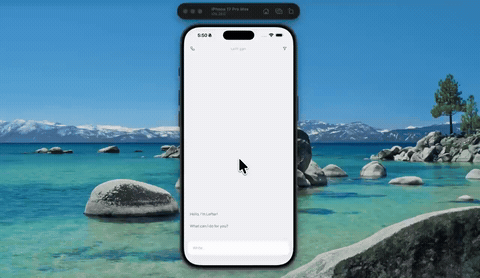

# ai-chat-ui



A chat app where sending a message feels like handing it off. Hit send and the text lifts out of the input and flies up into the thread, un-greying into its gradient bubble as it lands — the real bubble is already sitting there invisibly, so there's no pop when the two swap.

The sidebar pushes the whole chat screen aside and rounds its corners on the way, and a brand new chat types its own title into the history list.

Expo 57, expo-router, Reanimated, NativeWind.

## Run

```
npm install
npx expo start
```
