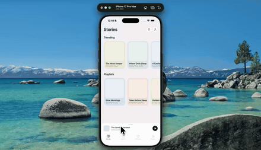

# audiobook-player



Drag the mini player up and it grows into the full player. The cover art never swaps or crossfades — it's one view travelling from a 44pt thumbnail to full-width hero art while the tab bar slides away and a blur builds up behind it. A quick flick finishes the job no matter how far you actually dragged.

While it's playing, the unplayed part of the progress bar is a row of dashes marching slowly to the left. Pause and they freeze where they are.

Expo 57, expo-router, Reanimated, NativeWind.

## Run

```
npm install
npx expo start
```
