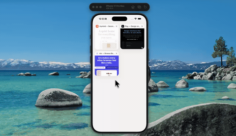

# bookmark-dissolve



Delete a bookmark and the card frosts over for a moment, then crumbles into dust and blows off to the right. It's a Skia snapshot of the live card cut into 3px tiles, each with its own delay, wind, spin and fall — the left edge starts coming apart before the right, so the whole thing has a direction to it.

Empty the board and it runs backwards: the dust flies back in and reassembles into cards.

Expo 57, expo-router, @shopify/react-native-skia, Reanimated, NativeWind.

## Run

```
npm install
npx expo start
```
