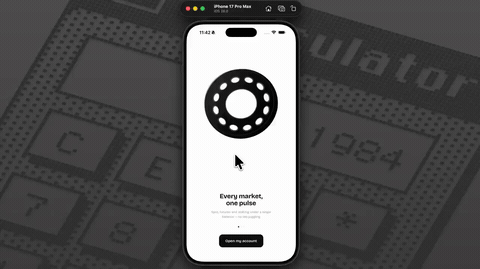

# Coin Pulse



Monochrome crypto app. Onboarding, a portfolio home, an assets breakdown, a markets browser with search and filters, and a trade screen with a line chart and order book.

Tap any coin anywhere in the app and the trade screen rebuilds around its price, order book ladder included. Home and Assets read the same holdings, so the balances can't drift apart.

Every mark is drawn in SVG — no image assets, no icon font, no remote avatars. Type is Bricolage Grotesque.

```
npm install
npm start
```
