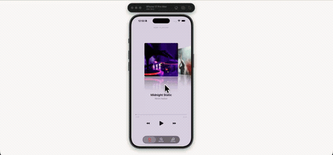

# coverdeck



iPod-style Cover Flow player with a native compact tab bar. The deck tilts covers in 3D with live-ish reflections — pan to flick through with momentum, tap a side cover to spring it to center, or use the transport controls. Browse and Library are scroll screens that compact the tab bar on the way down.

Expo 57, Reanimated, Gesture Handler, expo-image, SF Symbols, and [expo-native-compact-tabs](https://github.com/Kellytomi/expo-native-compact-tabs) for the bar — real Liquid Glass on iOS 26.

Dev build only (native Swift/Kotlin in the tab bar, no Expo Go). Carries the expo-modules-jsi patch for Xcode 26.0.x via patch-package.

## Run

```
npm install
npx expo run:ios
```

Covers load from Unsplash, so it needs a network connection.
