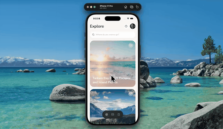

# destination-card-expand



Tap a destination and the card doesn't navigate anywhere — it grows. Its exact spot on screen gets measured and animated out to full bleed while the cards above slide up and the ones below drop away, then the detail content rises into place underneath.

One spring drives the whole thing, with each piece reading a different slice of it, so the screen moves as a single object instead of six animations going off at once.

Expo 57, Reanimated, NativeWind.

## Run

```
npm install
npx expo start
```
