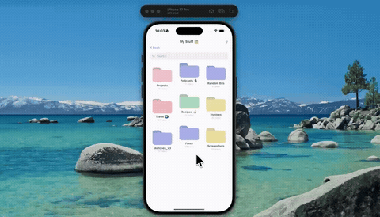

# fold-to-delete



Press and hold a folder to pick it up and a dashed delete zone slides in from the bottom. The card shrinks as you carry it closer, shrinks again the moment you cross into the zone, and collapses to nothing when you let go. An undo toast drops from the top with a shimmer running across it — tap it and the folder springs back into its old spot.

The card's scale is four separate springs multiplied together — lift, proximity, hover, vanish — so they blend into each other instead of fighting over the same property.

Expo 57, Reanimated, Gesture Handler, NativeWind.

## Run

```
npm install
npx expo start
```
