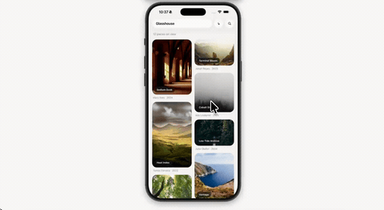

# Glasshouse



An art gallery built around two iOS-native tricks: Expo Router's zoom transition
(`Link.AppleZoom`) and liquid glass (`expo-glass-effect`). Tap a piece in the
masonry grid and the image flies into full screen with a glass dock; swipe down
and the zoom rewinds under your finger.

Only the plain image rides the zoom. Putting glass inside the transition clone
makes the interactive dismissal stutter, so the title chips stay behind on the
grid.

Zoom needs iOS 18+, glass needs iOS 26. Below that you get a normal push and
translucent fills.

```
npm install
npx expo start
```
