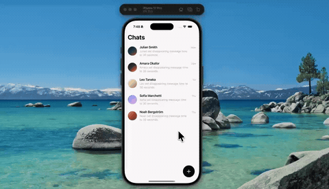

# gooey-fab



Tap the FAB and two more buttons stretch out of it like liquid — a neck pulls, thins, and pinches off into its own circle. That's blur plus an alpha threshold in Skia: blurring the circles smears them into each other, then the threshold snaps the edges back to crisp, so anything overlapping reads as one merging blob.

The second button leaves 60ms after the first with a looser spring so it overshoots a little further. Closing reverses the order and uses a stiffer spring, so it retracts instead of wobbling.

Expo 54, @shopify/react-native-skia, Reanimated, NativeWind.

## Run

```
npm install
npx expo start
```
