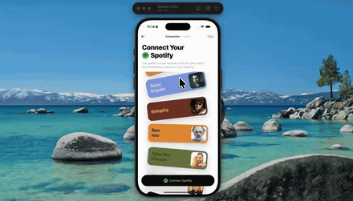

# spotify-onboarding



A connect flow with a wall of artist and city cards that bends around an invisible cylinder as you scroll. The card in the middle sits upright and full size; the ones above and below tilt away, shrink and slide back. It never ends — the list quietly teleports by one copy when you drift too far, so you can flick at it forever.

The pull-back is real trig off the tilt angle rather than a straight fade, and every card carries a small lean of its own so the stack looks scattered instead of mechanical.

Expo 57, Reanimated, SVG, expo-blur, NativeWind.

## Run

```
npm install
npx expo start
```
