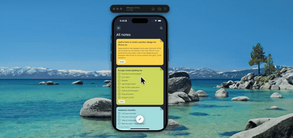

# sticky-note-peel



Drag a corner of a note and it peels. The fold runs along the perpendicular bisector between the corner and your finger, so the flap always lands exactly under your thumb no matter which way you pull. Flick it toward the dock to file or delete it.

Expo 57, Reanimated, Gesture Handler, SVG, NativeWind.

## Run

```
npm install
npx expo start
```
