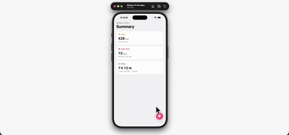

# sync-sheet



Recreation of the @expo/ui bottom-sheet example as a fully custom Reanimated sheet, tuned for iOS feel. A Health-style Summary screen with a heart FAB — tap it and a floating fitted sheet springs up over a live-blurred background with an Apple Health sync card. The health tile fans out from behind the app icon, each Continue press reveals two more rows and grows the sheet with a spring, and the blur sharpens continuously as you drag the sheet down to toss it away.

Expo 57, Reanimated, Gesture Handler, SVG, SF Symbols, expo-blur, haptics. Row icons are SF Symbols, so the sheet is iOS-only in spirit.

## Run

```
npm install
npx expo start
```
