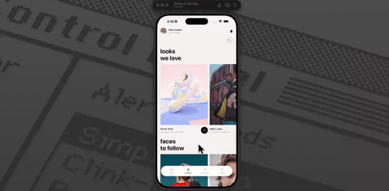

# trend-catcher



Streetwear browser with big lowercase headlines. On the collections screen the titles move at a different speed to the scroll, so they drift across the photos as you go. Open one and it's a card deck — drag the top product sideways and it rotates under your finger while the two behind it rise and grow into place. Let go past the line, or just flick it, and it flies off.

A small drift still counts as a tap, and vertical movement never steals the swipe, so the deck doesn't fight you.

Expo 57, Reanimated, SVG, NativeWind.

## Run

```
npm install
npx expo start
```

Card images load from Unsplash, so it needs a network connection.
