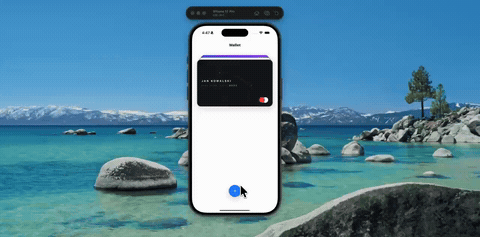

# wallet-card-gestures



A wallet-style deck with three layouts. Tap the front card and it rises to the top while the rest slide off and a transaction list fades in underneath. Tap a card further back and the deck fans out into evenly spaced rows instead, one card after another.

Tap-driven rather than drag-driven: each card just declares where it belongs in the current mode and springs there. Cards, header and button all share one spring, so the screen rearranges as a single system.

Expo 57, Reanimated, Gesture Handler, SVG, NativeWind.

## Run

```
npm install
npx expo start
```
